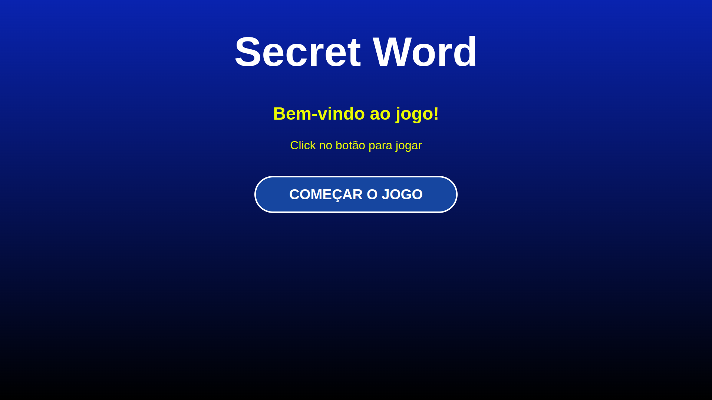
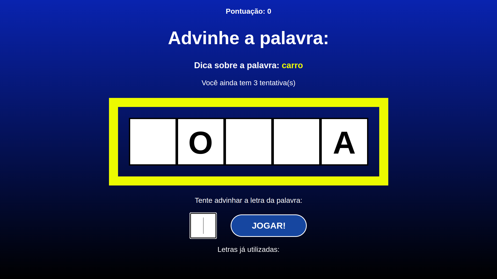
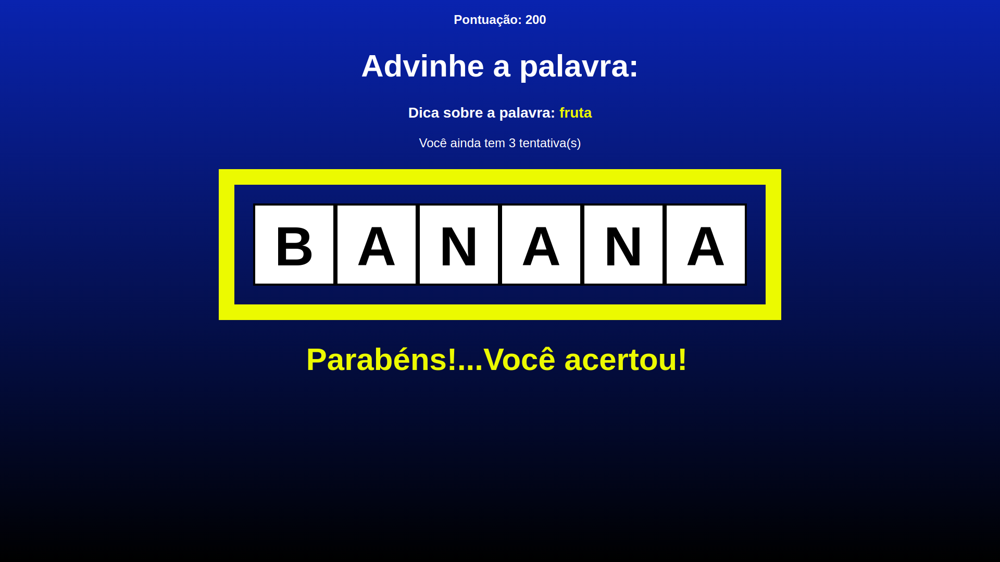

# `Projeto Secret Word Game - React `

## Visão Geral
Neste projeto **React**, desenvolvido com base nas sugestões de um curso online, foi criada uma interface de jogo cujo objetivo principal é acertar a palavra correta em até três tentativas, escolhendo as letras certas. Nesta implementação, temos uma aplicação que **gerencia** seus **estados** e respeita as etapas do jogo. Além disso, incluímos um **sistema de avanço** que **apresenta** novas **palavras**, **aumenta a pontuação** e **permite reiniciar** o jogo por **completo**. Tudo isto, seguindo uma **lógica**  de **negócio**, criando um arquivo para **base de dados**, utilizando os **Hooks** do React e estilizando com o **CSS**.

 

  
<strong>🗄️ Estrutura do projeto</strong>

  O jogo terá 3 estágios:
  1. Início
  2. O jogo em si no componente principal
  3. O final com o resultado

## Tecnologias utilizadas:

- Node.js
- React
- CSS
- Linux 
- Vite (sistema de construção (build) e desenvolvimento)

 

🗄️<strong>Execução do projeto</strong>
 

- Para executar, clone esse repositório:

  > git clone git@github.com:Leandro-Bertholini/secret_word_game.git

- Na pasta do projeto, instale as dependências:

  > npm install

- Inicie o Servidor de Desenvolvimento:

  > npm run dev

- Acesse o aplicativo:

  > http://localhost:3000

**OBS:** Após o comando "npm run dev", o app mostrará no terminal, o link do localhost para acessa-lo.

## 👉 Imagens do projeto

 

<!--  -->

 

 

 

### ☝ Desenvolvimento da Aplicação:

- Leandro Bertholini

